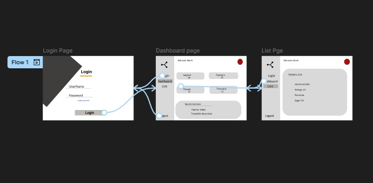
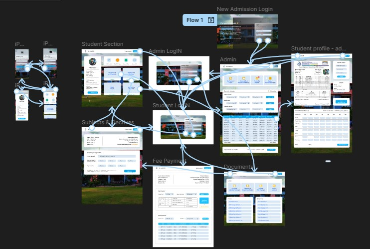

# Figma

# Student and Administration Management Portal

A UI/UX design project created in Figma for both Desktop and Mobile platforms.

## Prototype Links

### Desktop Version
https://www.figma.com/proto/GgdniTXnjM93mErzAHFC3V/Student-and-Administration-management-portal--Community-?node-id=1-563&t=91txDK01kiaFZyYL-0&scaling=min-zoom&content-scaling=fixed&page-id=0%3A1&starting-point-node-id=1%3A563

### Mobile Version
https://www.figma.com/proto/GgdniTXnjM93mErzAHFC3V/Student-and-Administration-management-portal--Community-?node-id=1-1146&t=91txDK01kiaFZyYL-0&scaling=min-zoom&content-scaling=fixed&page-id=0%3A1&starting-point-node-id=1%3A563

## Project Overview

This project is a Student and Administration Management Portal designed in Figma. The system provides a modern interface for students and administrators to manage records, attendance, academic information, and administrative workflows.

## Features

- Student Dashboard
- Attendance Management
- Student Record Management
- Administration Panel
- Responsive Desktop Design
- Responsive Mobile Design
- Interactive Prototypes

## Screenshots

### User Flow

### Student Management Design

## Tools Used

- Figma
- UI Design
- UX Design
- Prototyping

## Author

Vedant Wadekar
